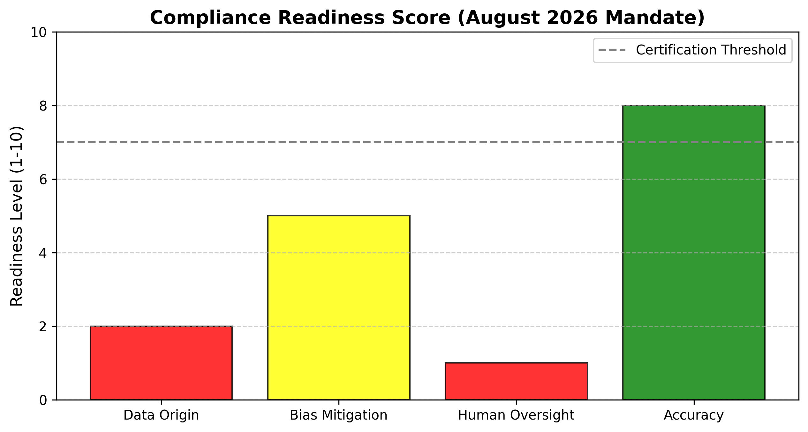

# 🛡️ AI-MedReg-Engine
### Regulatory Audit & Gap Analysis for High-Risk Medical AI

**AI-MedReg-Engine** is a specialized RAG (Retrieval-Augmented Generation) tool. It identifies critical compliance gaps in medical AI technical documentation, specifically targeting **Article 10 (Data Governance)** and **Article 14 (Human Oversight)**.

---

## 🧬 The "Wet Lab" Edge
As a Biologist, I understand that "high-quality data" is a clinical requirement, not just a technical one. This engine audits whether AI training logs meet the **Statistical Representativeness** required by the August 2, 2026 EU mandate.

## 🚀 Key Features
* **Article 10 Auditor:** Maps training datasets to the mandatory 8-point Data Governance checklist.
* **Article 14 Human Oversight:** Verifies real-time "Override/Kill-Switch" protocols in system architecture.
* **Privacy-Centric:** Designed for local execution (Kaggle/Local Host) to protect sensitive clinical and proprietary data.

## 🔴 Sample Gap Identification
* **Art. 10.3:** Missing statistical bridges between public datasets and target clinical populations.
* **Art. 14.4:** Retrospective oversight models (weekly dashboards) that fail the "real-time intervention" mandate.

### 📊 Visual Readiness Report

---
*Bridging the gap between Healthcare Policy and AI Engineering.*
---

## 💼 Partnerships & Consulting
I am currently selecting **one Beta Partner** in the MedTech or Diagnostic space for a complimentary **"Dark Audit"** (Private, local-first gap analysis). 

If you are developing a High-Risk AI tool and need to verify your **Article 10/14 compliance** before the August 2026 deadline, let's talk.

📫 **Reach Out:** [Your LinkedIn Link Here]  
📍 **Location:** Washington D.C. / Maryland / Remote  
🧬 **Focus:** Bio-Statistical Representativeness & Human-in-the-Loop Oversight

---
